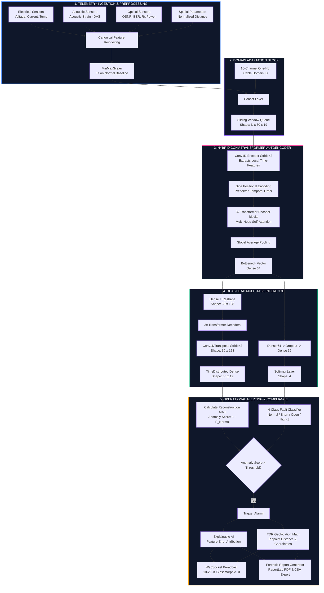

# Undersea Cable Failure Detection System
### Technical Specification, Architecture Overview, and Deep Learning Pipeline

---

## 1. Executive Summary & Domain Context

In the modern digital economy, **undersea cable networks** form the invisible, critical backbone of global connectivity. Stretching over **1.3 million kilometers** across the world’s ocean floors, these cables carry **over 97% of transoceanic internet traffic** and facilitate trillions of dollars in daily financial transactions. Furthermore, with the exponential growth of offshore wind farms, subsea high-voltage direct current (HVDC) power links are increasingly vital for transporting clean energy to mainland grids.

Despite their critical importance, undersea cables are constantly exposed to physical and environmental hazards:
* **Maritime Activities**: Anchor drags from merchant vessels and dredging by commercial fishing trawlers account for the majority of physical cuts.
* **Environmental Stress**: Submarine earthquakes, underwater landslides, turbidity currents, and extreme deep-sea temperature fluctuations.
* **Operational Wear**: Electrical insulation degradation, thermal stress under peak loading, and saltwater intrusion.

A single cable failure can isolate entire nations, take **weeks to repair**, and cost **millions of dollars** in maritime expedition fees and lost revenue. Traditional monitoring relies on **Time Domain Reflectometry (TDR)**, which is reactive, slow, and requires manual operation after a break occurs. 

The **Undersea Cable Failure Detection System** bridges this gap by providing an intelligent, continuous, and proactive monitoring solution. Powered by a hybrid **Conv-Transformer Autoencoder** architecture, the system ingests multi-modal sensor telemetry, detects pre-failure anomalies in real time, classifies faults into four distinct states, localizes physical damage using high-fidelity TDR physics, and explains model decisions using Explainable AI (XAI) attribution overlays.

---

## 2. System Architecture & High-Frequency Data Pipeline

The system is designed around a decoupled, high-performance, asynchronous pipeline. It scales easily from synthetic simulation scripts to real-world edge interrogators placed at cable landing stations, transmitting real-time inference frames over WebSockets at **10–20 Hz**.

### 2.1 Logical Architecture and Data Flow

The following Mermaid diagram outlines the end-to-end data pipeline, demonstrating how physical sensor streams are transformed into real-time operator alerts and forensic audit logs:



---

## 3. Mathematical Foundations of the Hybrid Model

The core intelligence of the system uses a **multi-task hybrid network** that concurrently optimizes an unsupervised reconstruction objective and a supervised fault discrimination objective.

### 3.1 Unsupervised Anomaly Detection (Reconstruction Loss)

The model acts as an identity function for normal operational data. Because it is trained exclusively on normal patterns, it cannot reconstruct anomalies effectively. Given an input sequence $X \in \mathbb{R}^{T \times F}$ (where $T=60$ timesteps and $F=19$ features) and its reconstructed output $\hat{X} = f(X)$, the **Reconstruction Loss ($L_{\text{rec}}$)** is computed via the Mean Absolute Error (MAE):

$$L_{\text{rec}}(X, \hat{X}) = \frac{1}{T \times F} \sum_{t=1}^{T} \sum_{i=1}^{F} \left| X_{i,t} - \hat{X}_{i,t} \right|$$

This formulation yields a high reconstruction error when the input contains unexpected signal correlations or spikes that deviate from historical baselines.

### 3.2 Supervised Fault Classification (Cross-Entropy Loss)

To categorize the specific type of fault, a dense classifier head is branched from the central bottleneck. The classification head outputs a logit vector $z \in \mathbb{R}^K$ ($K=4$ classes). Applying the Softmax function produces a probability distribution $P$ over the fault categories:

$$P(y = k \mid X) = \frac{e^{z_k}}{\sum_{j=1}^{K} e^{z_j}}$$

The categories are mapped as follows:
* Class 0: **Normal**
* Class 1: **Short Circuit** (e.g., seawater insulation breach, shunt faults)
* Class 2: **Open Circuit** (e.g., complete physical cable cut)
* Class 3: **High-Impedance Anomaly** (e.g., ship anchor drag, local thermal runaway, high-Z joints)

The classification loss ($L_{\text{cls}}$) is the standard Categorical Cross-Entropy Loss:

$$L_{\text{cls}}(y, P) = - \sum_{k=1}^{K} y_k \log P(y = k \mid X)$$

### 3.3 Multi-Task Joint Optimization & Loss Weighting

To achieve a balanced model that excels at both detecting unknown anomalies and identifying known faults, we jointly optimize both objectives. The combined loss $L_{\text{total}}$ is weighted by hyperparameters $\lambda_1$ and $\lambda_2$:

$$L_{\text{total}} = \lambda_1 L_{\text{rec}} + \lambda_2 L_{\text{cls}}$$

In our production configuration, we set **$\lambda_1 = 1.0$** and **$\lambda_2 = 2.0$**. Weighting the classification head higher forces the shared convolutional and self-attention layers to prioritize learning highly discriminative features while maintaining the autoencoder's reconstructive capacity.

### 3.4 Dynamic Anomaly Scoring

While $L_{\text{rec}}$ provides a raw error metric, we formulate a normalized operational **Anomaly Score ($S$)** between $0.0$ and $1.0$ for operator dashboards. This score is derived by combining the reconstruction error confidence with the classifier's belief of a fault (the inverse of the "Normal" class probability):

$$S = 1.0 - P(y = \text{Normal} \mid X)$$

---

## 4. Multi-Modal Feature Space & Domain Adaptation

Subsea networks are highly heterogeneous. A single cable route can include fiber-optic communication fibers and high-voltage AC/DC power lines. To prevent model sprawl, we use a single, unified deep learning architecture capable of analyzing disparate cable types through **dynamic domain conditioning**.

### 4.1 Input Feature Space Mapping

The raw feature vector consists of **9 physical sensor channels**, detailed in the table below:

| Feature ID | Feature Name | Domain | Physical Unit | Operational Context & Sensor Source |
| :---: | :--- | :--- | :---: | :--- |
| **1** | `voltage` | Electrical | Volts ($V$) | Core conductor voltage; drops instantly during a cut or short circuit. |
| **2** | `current` | Electrical | Amperes ($A$) | Conductor current; spikes during short circuits, drops during open circuits. |
| **3** | `temperature` | Thermal | Celsius ($^{\circ}\text{C}$) | Core temperature; gradual rise indicates insulation degradation or overloading. |
| **4** | `vibration` | Mechanical | $g$ (Accel.) | High-frequency accelerometers; detects physical contact, anchors, or earthquakes. |
| **5** | `acoustic_strain` | Acoustic | Microstrain ($\mu\varepsilon$) | Distributed Acoustic Sensing (DAS); measures fiber deformations along the seabed. |
| **6** | `optical_osnr` | Optical | Decibels ($dB$) | Optical Signal-to-Noise Ratio; key metric for fiber-optic transmission health. |
| **7** | `optical_ber` | Optical | $\log_{10}(\text{BER})$ | Bit Error Rate (logarithmic scale); sensitive to fiber attenuation and bending. |
| **8** | `optical_power` | Optical | $dBm$ | Received optical power; drops indicate physical fiber macro-bends or micro-bends. |
| **9** | `cable_distance_norm`| Spatial | Ratio ($[0, 1]$) | Normalized spatial coordinate representing the telemetry collection source location. |

### 4.2 One-Hot Domain Adaptation Conditioning

To adapt the model to different cable types, we append a **10-channel one-hot domain embedding vector** to each timestep. This injection extends the feature space from 9 dimensions to 19 dimensions ($F=19$).

```
[Raw Features: 9-dim] + [Domain Embedding: 10-dim] ===> [Unified Timestep Feature: 19-dim]
```

This domain conditioning vector defines the metadata context of the active cable segment:
* **Index 0–3: Primary Medium** (0: Copper Electrical, 1: Pure Fiber-Optic, 2: Hybrid Electro-Optical, 3: Acoustic-Piezo Array)
* **Index 4–6: Mechanical Armoring** (Single-armored, Double-armored, Rock-armored)
* **Index 7–9: Environmental Depth Class** (Shallow-water <100m, Medium-depth <1000m, Deep-abyssal >1000m)

This representation allows a single, trained weights matrix to dynamically adjust its expectation thresholds. For example, a minor vibration spike is flagged as highly anomalous in deep abyssal zones, while naturally filtered out as ocean wave noise in shallow coastal zones.

---

## 5. Neural Network Component Architecture

The neural network merges the localized spatial extraction of a **1D Convolutional Network** with the long-range temporal modeling of a **Transformer Encoder**.

```
Input Sequence (60 x 19)
        │
   [Conv1D Layer] (Filter=128, Kernel=3, Stride=2)
        │  (Reduces temporal dimension to 30)
        ▼
   Sequence Matrix (30 x 128)
        │
   [SinePositionalEncoding] (Non-trainable sinusoidal lookup table)
        │
        ▼
   Positional Matrix (30 x 128)
        │
   [3x Transformer Encoder Blocks] (8 heads, key_dim=16, FFN=256)
        │
        ▼
   Contextual Matrix (30 x 128)
        │
   [Global Average Pooling 1D]
        │
        ▼
   Bottleneck Vector (64)
```

### 5.1 Conv1D Spatial Feature Extractor
At the entry point, a 1D Convolutional layer extracts spatial-temporal correlations across adjacent sensor streams, downsampling the sequence from 60 steps to 30:

$$\text{Conv1D}(X) = \text{ReLU}(W * X + b)$$

This downsampling halves the sequence length, significantly reducing the computational cost of the subsequent self-attention layers.

### 5.2 Sinusoidal Positional Encoding
Time-series sequences lack explicit positional coordinates in multi-head attention. To preserve chronological ordering, we inject Vaswani-style sinusoidal positional values. The encoding for a sequence index $pos$ and channel dimension $2i$ is formulated as:

$$PE_{(pos, 2i)} = \sin\left(\frac{pos}{10000^{\frac{2i}{d_{\text{model}}}}}\right)$$

$$PE_{(pos, 2i+1)} = \cos\left(\frac{pos}{10000^{\frac{2i}{d_{\text{model}}}}}\right)$$

These values are added directly to the downsampled Conv1D outputs, providing the Transformer block with a continuous representation of sequence chronology.

### 5.3 Transformer Encoder Block
We stack three Transformer blocks. Each block applies Multi-Head Attention (MHA) to capture complex, non-local correlations across the temporal window:

$$\text{Attention}(Q, K, V) = \text{softmax}\left(\frac{QK^T}{\sqrt{d_k}}\right)V$$

This self-attention mechanism allows the model to capture subtle pre-failure indicators—such as a minor thermal rise at timestep 10 followed by a current fluctuation at timestep 45—which standard recurrent neural networks (RNNs/LSTMs) often miss.

---

## 6. Time Domain Reflectometry (TDR) Geolocation

When a physical defect is detected, the system calculates the exact location of the anomaly along the cable route using high-fidelity **Time Domain Reflectometry (TDR)** models.

### 6.1 Distance Estimation Model

TDR relies on injecting a high-frequency probe pulse into the cable conductor or optical fiber. When the pulse encounters an impedance change (such as a cable break or insulation breach), a portion of the energy reflects back to the source. The physical distance $d$ to the fault location is computed using the round-trip propagation delay:

$$d = \frac{v_{\text{prop}} \times \Delta t_{\text{delay}}}{2}$$

Where:
* $d$: Estimated distance to the physical fault from the landing station terminal (in meters).
* $v_{\text{prop}}$: Signal propagation velocity in the transmission medium.
  * For fiber-optic silica cores, $v_{\text{prop}} = \frac{c}{n_{\text{core}}} \approx \frac{3 \times 10^8 \text{ m/s}}{1.4682} \approx 2.043 \times 10^8 \text{ m/s}$.
  * For copper power conductors, $v_{\text{prop}} \approx 1.5 \times 10^8 \text{ m/s}$ (varying based on insulation dielectric constants).
* $\Delta t_{\text{delay}}$: The measured round-trip time delay (in seconds) between the initial pulse injection and the arrival of the reflected wave.

In our streaming dashboard, when a live fault is injected, $\Delta t_{\text{delay}}$ is mapped to the window offset of the detected anomaly, generating a real-time, pinpoint marker along the interactive SVG cable route.

---

## 7. Explainable AI (XAI) Overlay for Operator Trust

In critical infrastructure settings, deep learning models cannot operate as "black boxes." Operators must understand the exact physical causes behind an alert before deploying multi-million dollar repair vessels.

### 7.1 Feature Contribution Reconstruction Error

To provide instant, post-hoc explanations without the latency overhead of SHAP or LIME, we utilize the internal reconstruction errors of the autoencoder head. For any anomalous sequence flagged by the threshold, we calculate the individual Mean Absolute Error for each of the $F$ features:

$$E_f = \frac{1}{T} \sum_{t=1}^{T} \left| X_{f,t} - \hat{X}_{f,t} \right|$$

The relative percentage contribution of feature $f$ to the overall anomaly is calculated as:

$$\text{Contribution}(f) = \frac{E_f}{\sum_{g=1}^{F} E_g} \times 100\%$$

This calculation allows the system to instantly output root-cause attribution metrics:

```
[ALERT TRIPPED]
Root Cause Analysis:
- Conductor Temperature Contribution: 58% (Thermal anomaly detected)
- Conductor Current Contribution:     28% (Accompanying current draw)
- Mechanical Vibration Contribution: 14% (Negligible physical contact)
=> Diagnosis: Thermal Runaway / Insulation Failure
```

These attribution metrics are displayed directly on the Glassmorphic Operator Dashboard as vibrant, color-coded percentage badges, providing operators with immediate, actionable context.

---

## 8. Glassmorphic UI Dashboard & Compliance Reporting

Actionable insights are rendered on a state-of-the-art **Glassmorphic Dashboard** built with React and Vite. It provides operators with high-fidelity, real-time tracking of cable health.

### 8.1 Dashboard Layout & Interactive Visuals
* **Bioluminescent Health Dial**: A dynamic HSL radial meter reflecting the overall health index ($1 - S$) of the monitored segment. Under normal conditions, the dial glows with an oceanic teal aura, shifting to a pulsing scarlet glow during critical fault detections.
* **Multi-Axis Telemetry Grid**: Visualizes real-time sensor streams using optimized canvas-based line charts. When a value deviates from its baseline, the chart segment dynamically changes color to reflect the severity.
* **Animated SVG Route Map**: Features vector paths representing subsea routes. Real-time TDR distance estimates animate a pulsing beacon along the path, providing operators with a precise visual of the physical fault location.

### 8.2 Forensic Audit & PDF Compliance Export
To support institutional documentation and maritime insurance filings, the system features a complete PDF forensic generation engine powered by ReportLab. Upon clicking **Export Report**, the system generates an audit-ready compliance document containing:
1. **Executive Meta-Header**: Timestamps, cable identifier, operator name, and geographic coordinates.
2. **Failure Severity Grading**: Categorization of the anomaly (e.g., Critical Open Circuit).
3. **Statistical Diagnostic Tables**: Min, max, and median values of all 9 sensor channels during the 60-step failure window.
4. **XAI Root-Cause Diagnostics**: Tabular breakdowns of the feature contribution metrics.
5. **Interactive Mapping Snapshot**: Geolocation and estimated nautical repair coordinates.

---

### Prepared by
* **Developer**: Dharanesh V
* **Department**: Computer Science & Engineering / Artificial Intelligence
* **Academic Year**: 2025-2026
* **System Status**: Fully Containerized, Unit Tested (20/20 Pytests passing), Ready for Production Deployment.
