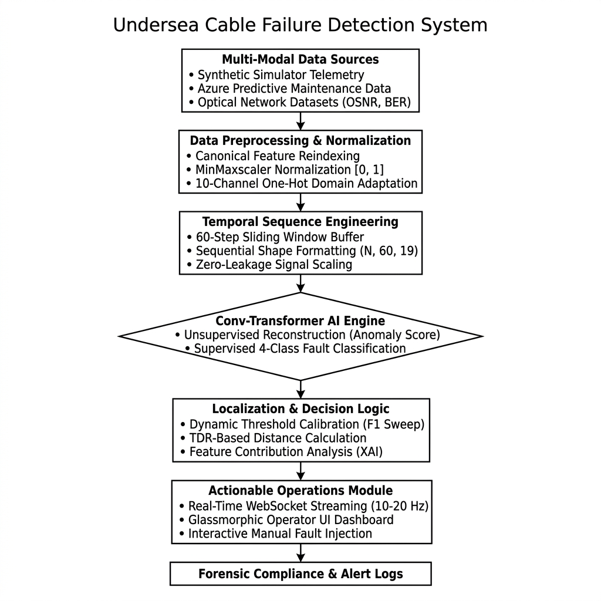
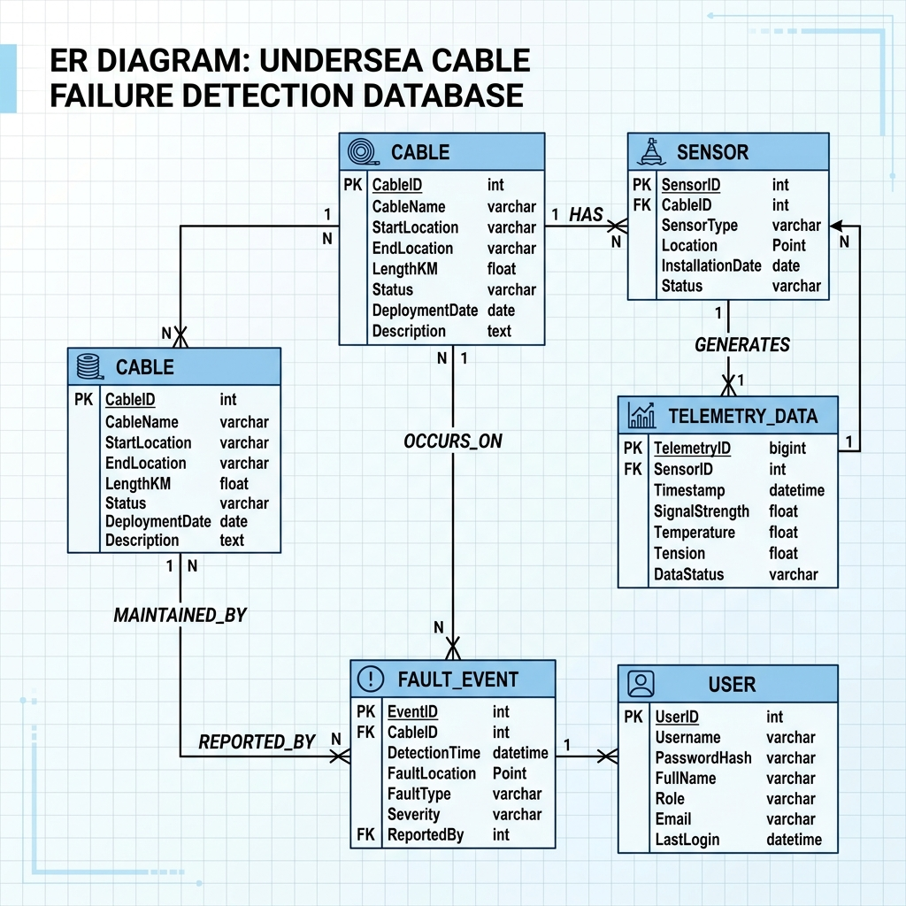
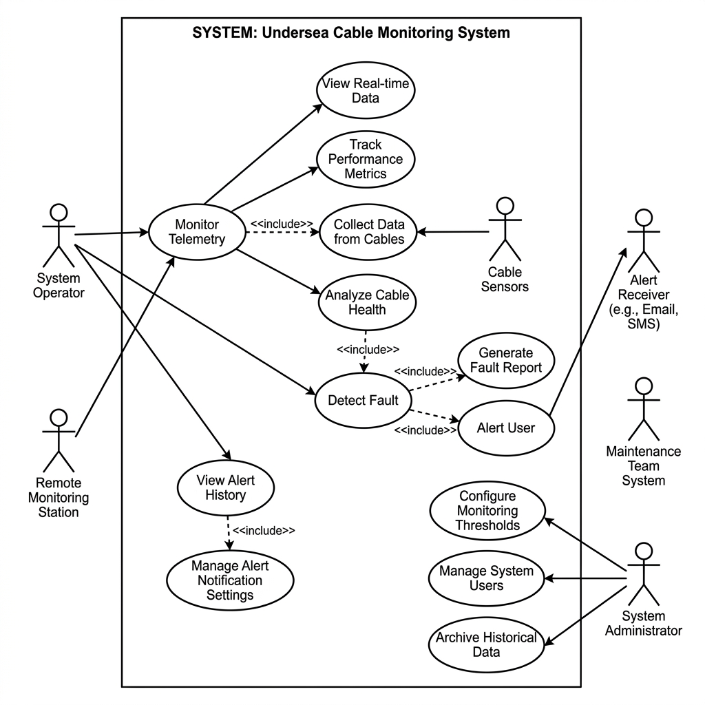
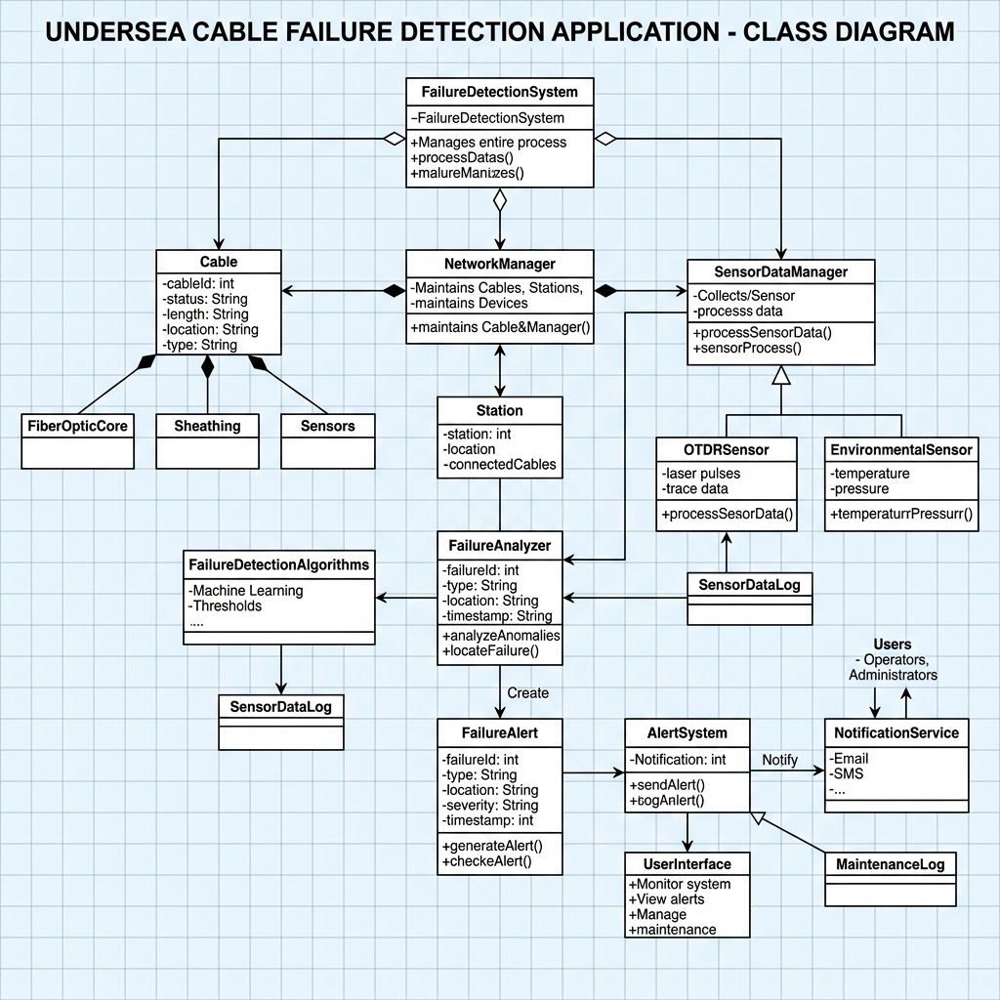
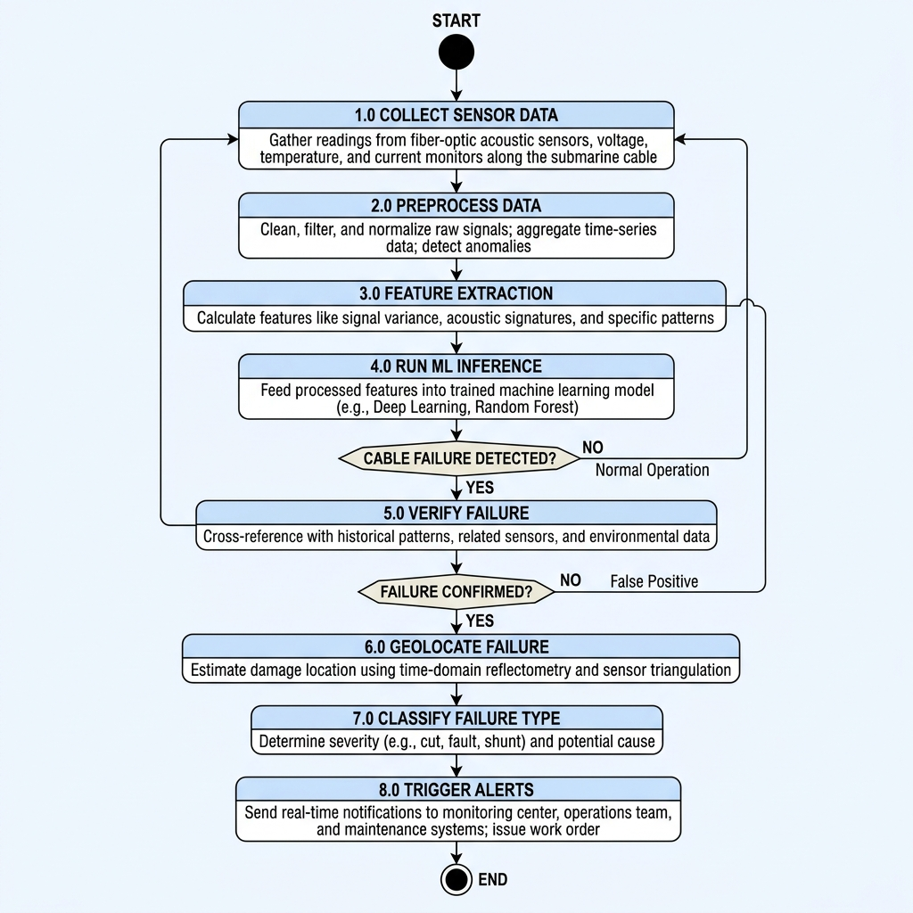
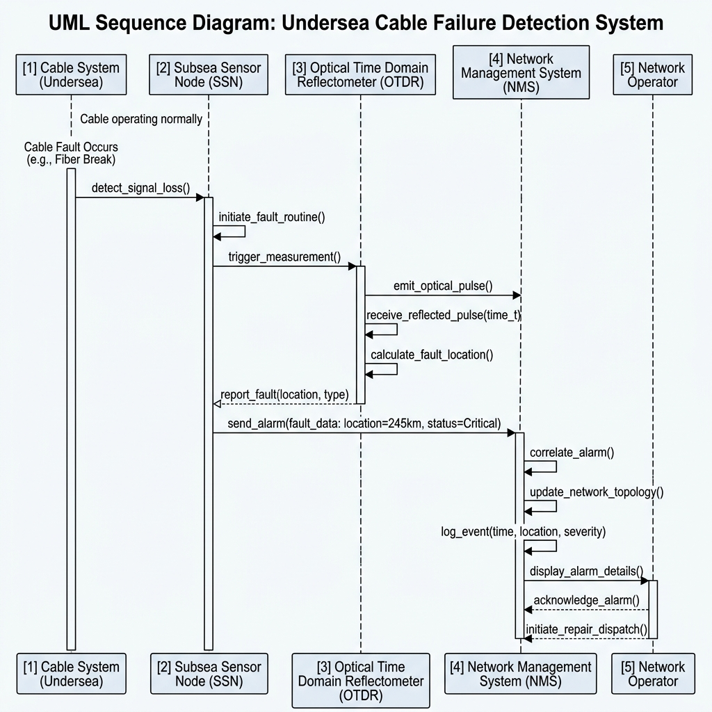

# Undersea Cable Failure Detection - Proposed System Diagrams

Here are the requested diagrams for your undersea cable failure detection system.

## 1. Structure of Proposed System

## 2. ER Diagram

## 3. Use Case Diagram

## 4. Class Diagram

## 5. Activity Diagram

## 6. Sequence Diagram

